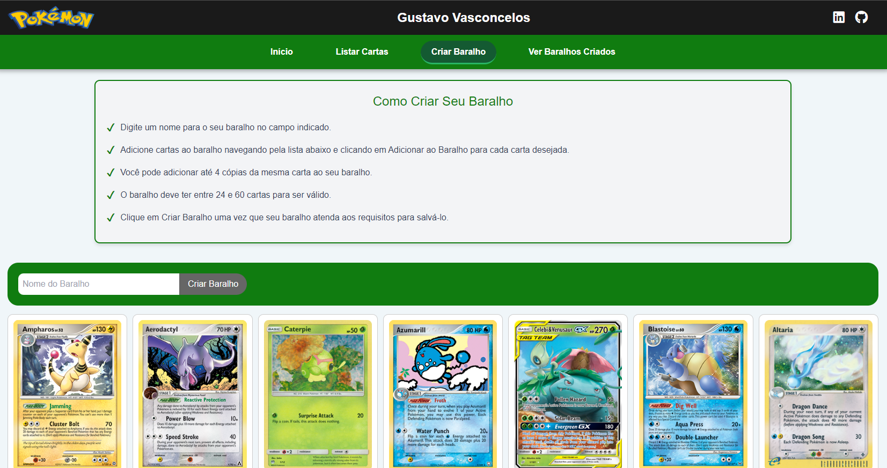
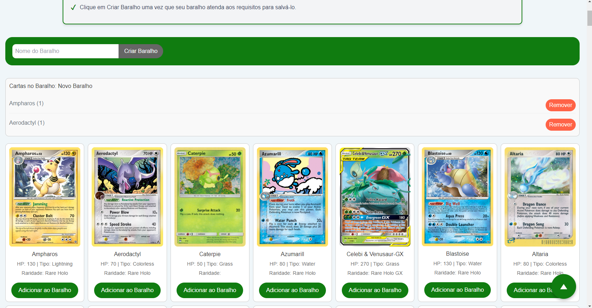
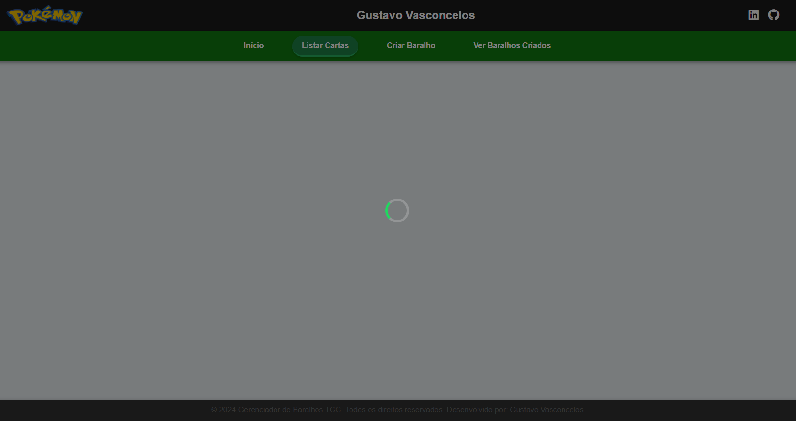
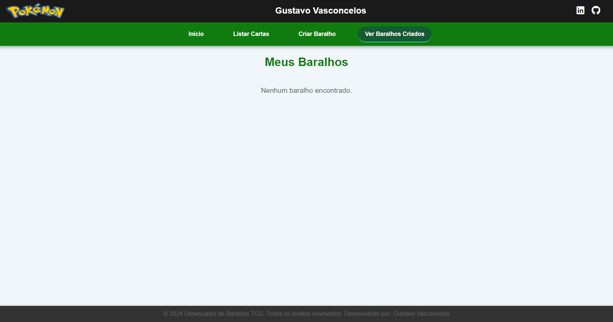
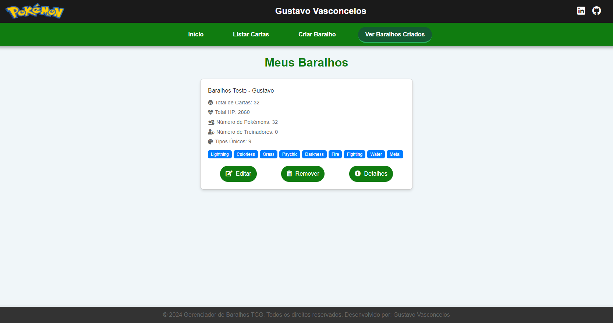
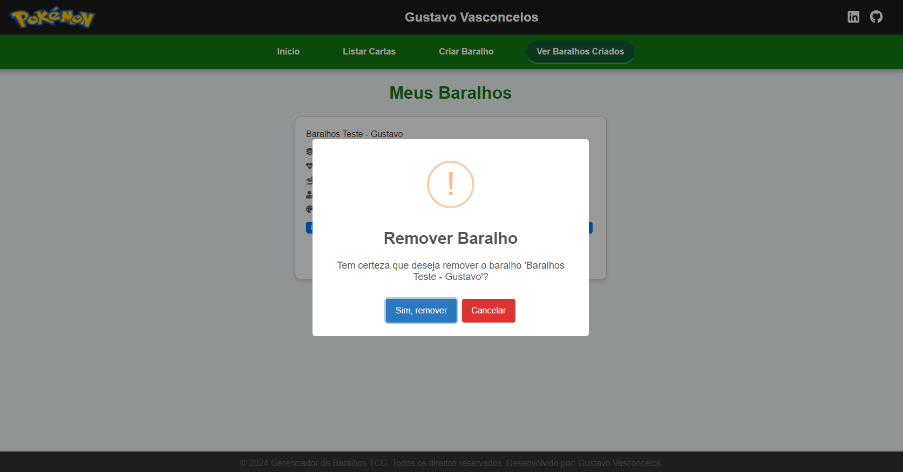
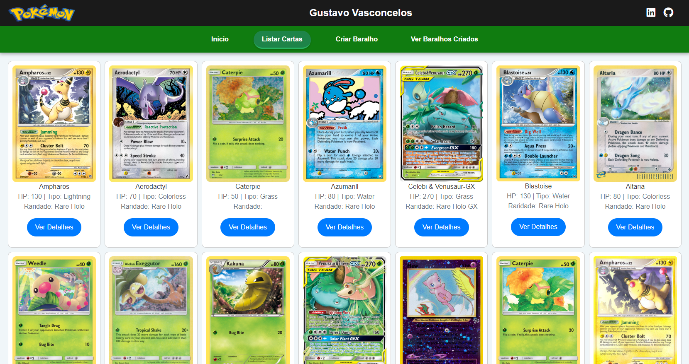
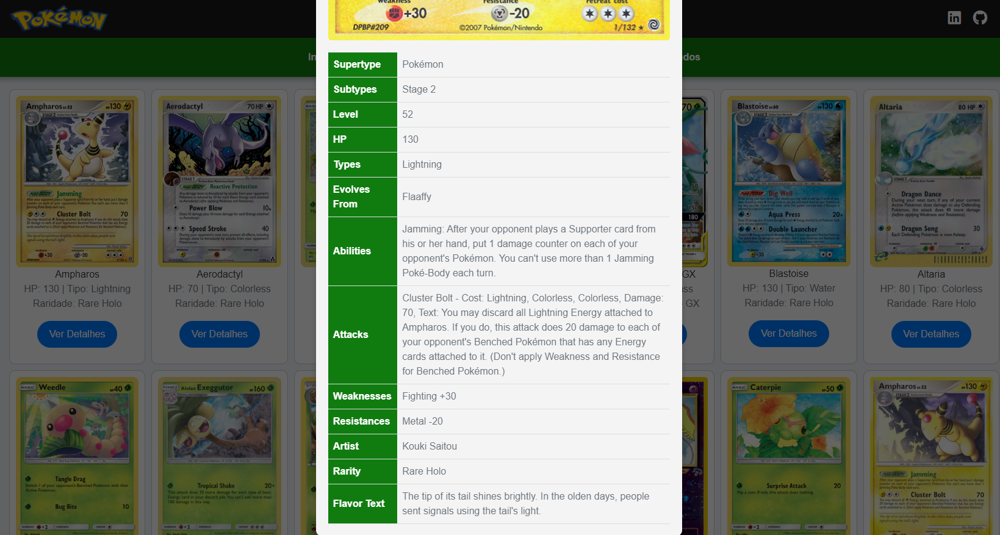

# Pokemon TCG Game - Gustavo Vasconcelos

Este projeto é uma aplicação web projetada para criar e gerenciar baralhos do jogo de cartas colecionáveis Pokémon. Construído com Angular e estilizado com um tema inspirado no Microsoft Xbox, a aplicação permite que os usuários naveguem pelas cartas Pokémon, adicionem-nas a baralhos personalizados e gerenciem esses baralhos.

## 🛠️ Desenvolvedor

Este projeto foi desenvolvido por Gustavo Vasconcelos.

## ⚙️ Instalação

Clone o projeto usando:
```
git clone https://github.com/sasgustav/uds-gustavo-vasconcelos-frontend-tcg.git
```
Entre no diretório do projeto:
```
cd uds-gustavo-vasconcelos-frontend-tcg
```
Instale as dependências:
```
npm install
```

## 🚀 Executando o Projeto

Para iniciar o servidor de desenvolvimento, execute:
```
ng serve
```
Navegue para `http://localhost:4200/`. O aplicativo recarregará automaticamente se você alterar algum dos arquivos fonte.

## 🧩 Geração de Código

Execute `ng generate component nome-do-componente` para gerar um novo componente. Você também pode gerar diretivas, pipes, serviços, classes, guards, interfaces, enums e módulos usando `ng generate`.

## 🏗️ Construção

Execute `ng build` para construir o projeto. Os artefatos de construção serão armazenados no diretório `dist/`.

## 🧪 Testes

### Testes unitários

Execute `ng test` para realizar os testes unitários via [Karma](https://karma-runner.github.io).

### Testes de ponta a ponta

Execute `ng e2e` para realizar os testes de ponta a ponta através de uma plataforma de sua escolha.

## 🔍 Uso

1. **Navegando na Aplicação**: Inicie o servidor de desenvolvimento e navegue até `http://localhost:4200/` para ver a aplicação.
2. **Criando Baralhos**: Utilize o recurso 'Criar Baralho' para montar novos baralhos.
3. **Visualizando Baralhos**: Vá para 'Meus Baralhos' para ver todos os baralhos que você criou.
4. **Editando e Excluindo Baralhos**: Opções para editar ou excluir cada baralho.
5. **Detalhes das Cartas**: Veja informações detalhadas clicando em qualquer carta.

## 📸 Capturas de Tela

- **Página Principal:** 
  
  
- **Criar Baralho:**
   
  
  

- **Meus Baralhos:** 
  

- **Detalhes do Baralho:**
  
  

- **Listar Cartas:**
  

- **Modal de Detalhes:**
  
  

## 🆘 Ajuda

Para obter mais ajuda sobre o Angular CLI, use `ng help` ou confira a página [Visão Geral e Referência de Comandos do Angular CLI](https://angular.io/cli).

---

#### 💻 Desenvolvido por: 🐙[Gustavo Vasconcelos](https://github.com/sasgustav)
#### 👤 LinkedIn: 🔗[Gustavo Vasconcelos](https://www.linkedin.com/in/gustavo-vasconcelos-software-engineer/)