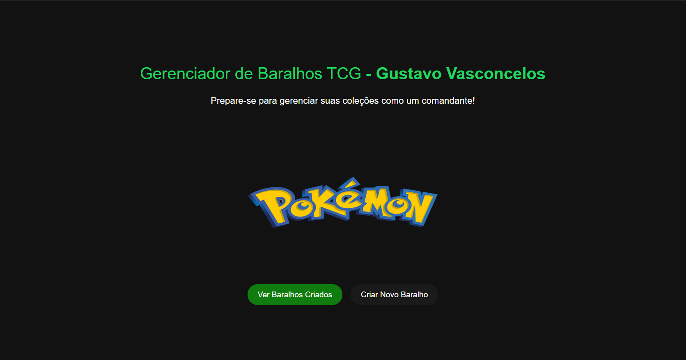

# Pokemon TCG Game - Gustavo Vasconcelos

Este projeto é uma aplicação web projetada para criar e gerenciar baralhos do jogo de cartas colecionáveis Pokémon. Construído com Angular e estilizado com um tema inspirado no Microsoft Xbox, a aplicação permite que os usuários naveguem pelas cartas Pokémon, adicionem-nas a baralhos personalizados e gerenciem esses baralhos.

## 🛠️ Desenvolvedor

Este projeto foi desenvolvido por Gustavo Vasconcelos.

## 🚀 Servidor de desenvolvimento

Execute `ng serve` para iniciar o servidor de desenvolvimento. Navegue para `http://localhost:4200/`. O aplicativo recarregará automaticamente se você alterar algum dos arquivos fonte.

## 🧩 Geração de código

Execute `ng generate component nome-do-componente` para gerar um novo componente. Você também pode gerar diretivas, pipes, serviços, classes, guards, interfaces, enums e módulos usando `ng generate`.

## 🏗️ Construção

Execute `ng build` para construir o projeto. Os artefatos de construção serão armazenados no diretório `dist/`.

## 🧪 Testes

### Testes unitários

Execute `ng test` para realizar os testes unitários via [Karma](https://karma-runner.github.io).

### Testes de ponta a ponta

Execute `ng e2e` para realizar os testes de ponta a ponta através de uma plataforma de sua escolha. É necessário adicionar primeiro um pacote que implemente capacidades de testes de ponta a ponta.

## 🔍 Uso

1. **Navegando na Aplicação**: Inicie o servidor de desenvolvimento e navegue até `http://localhost:4200/` para ver a aplicação.
2. **Criando Baralhos**: Utilize o recurso 'Criar Baralho' para montar novos baralhos. Digite um nome para o seu baralho e comece a adicionar cartas.
3. **Visualizando Baralhos**: Vá para 'Meus Baralhos' para ver todos os baralhos que você criou.
4. **Editando e Excluindo Baralhos**: Cada baralho possui opções para editar seu conteúdo ou excluí-lo completamente.
5. **Detalhes das Cartas**: Clique em qualquer carta para ver suas informações detalhadas.

## 📸 Capturas de Tela

Capturas de tela das diferentes páginas do app para dar aos usuários uma prévia visual das funcionalidades:

- **Página Principal:** 
  
- **Criar Baralho:**
   
  
  
- **Meus Baralhos:** 
  
- **Detalhes do Baralho:** Inserir imagem

## 🆘 Ajuda

Para obter mais ajuda sobre o Angular CLI, use `ng help` ou confira a página [Visão Geral e Referência de Comandos do Angular CLI](https://angular.io/cli).

---

#### 💻 Desenvolvido por: 🐙[Gustavo Vasconcelos](https://github.com/sasgustav)

#### 👤 LinkedIn: 🔗[Gustavo Vasconcelos](https://www.linkedin.com/in/gustavo-vasconcelos-software-engineer/)
